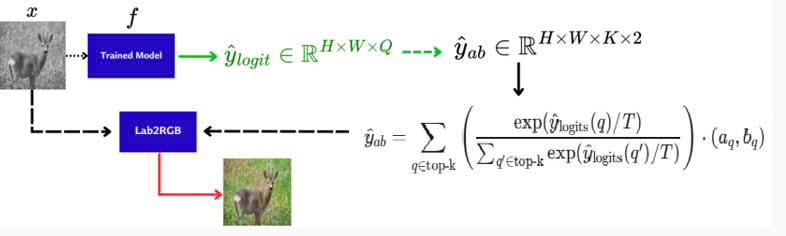

# Video Thuyết trình: 
https://drive.google.com/drive/folders/17ps9bAI0Wob2qB2JPBtzWKiALZgYc2Oo?usp=sharing
# Colorful-Image-Colorization
Dự án này triển khai một mạng nơ-ron tích chập sâu (deep convolutional neural network) để tự động tô màu ảnh – tức là giải quyết bài toán chuyển ảnh đầu vào dạng đen trắng (grayscale) thành ảnh màu.

Dự án này được lấy cảm hứng từ bài báo: [Colorful Image Colorization](https://arxiv.org/abs/1603.08511)
# Demos

# Không gian màu CIE Lab
- Dùng thuật toán K-means để phân cụm các giá trị màu thực tế từ tập dữ liệu ảnh (ví dụ: ImageNet) thành 313 cụm (cluster). Mỗi cụm đại diện cho một 'bin màu‘, giúp giảm độ phức tạp khi mô hình dự đoán màu.

# Regression với kênh màu CIE Lab
- Cách tiếp cận cơ bản đầu tiên để giải quyết bài toán tô màu ảnh là xem nó như một bài toán hồi quy

# Phương pháp Classification-centroid
- Ý tưởng ban đầu là chọn các ô (bin) có xác suất cao nhất và gán giá trị tâm (ab) của chúng cho các pixel tương ứng.

# Phương pháp Classification-softmax
- Ý tưởng là sử dụng top-k lớp màu được dự đoán, chúng ta chuyển chúng thành giá trị ab. Giá trị ab cuối cùng được tính bằng tổng có trọng số của top-k giá trị ab, với trọng số là xác suất softmax của chúng

# Đánh giá
- Theo góc độ định lượng: Sử dụng MSE&PSNR để đánh giá chất lượng tái tạo màu

- Theo góc độ định tính:
    + Visual Turing Test – Người dùng được hỏi ảnh nào là ảnh thật giữa ảnh tô màu và ảnh gốc → kiểm tra cảm giác “tự nhiên” của ảnh tô màu.
    + Visual Comparison – So sánh trực quan (hiển thị các ảnh tô màu của nhiều phương pháp)

# Mục tiêu
 - Phát triển thuật toán tô màu ảnh trắng đen tự động bằng mạng CNN, tạo ra hình ảnh màu sống động từ ảnh xám, thử nghiệm trên các bộ dữ liệu lớn như ImageNet.

 - Cải thiện chất lượng và đa dạng màu sắc bằng cách áp dụng phân loại màu với hàm mất mát cân bằng và kỹ thuật lấy trung bình ủ để tối ưu độ sống động và tính nhất quán không gian.

 - Đánh giá hiệu quả phương pháp đề xuất qua kiểm tra Turing tô màu và khả năng ứng dụng trong học biểu diễn tự giám sát cho các nhiệm vụ phân loại, phát hiện và phân đoạn ảnh.

# Tài liệu tham khảo nhóm đọc
- [x] Color diagnosticity in object recognition - Published: August 1999 (James W. Tanaka & Lynn M. Presnell )
- [x] Machine Learning Mastery With Python Understand Your Data Create Accurate Models and Work Projects End-to-End
- [x] https://github.com/jantic/DeOldify?tab=readme-ov-file#about-deoldify 
- [x] Color Feature Based Dominant Color Extraction (YOUNGHA CHANG , (Member, IEEE), AND NOBUHIKO MUKAI)
- [x] Colorful Image Colorization (Oct 2016, ECCV) (https://www.youtube.com/watch?v=4xoTD58Wt-0)
- [x] https://github.com/richzhang/colorization
- [x] Image Colorization Using the Global Scene-Context Style and Pixel-Wise Semantic Segmentation (Author: Tram-Tran Nguyen-Quynh, S.H. Kim, Nhu-Tai Do )
- [x] Colorful Image Colorization (Oct 2016, ECCV, Author Richard Zhang, Phillip Isola(B), and Alexei A. Efros) (Papper)
- [x] Learning Representations for Automatic Colorization (Author Gustav Larsson1, Michael Maire2, and Gregory Shakhnarovich2)
- [x] Dahl, R.: Automatic colorization (2016).  
